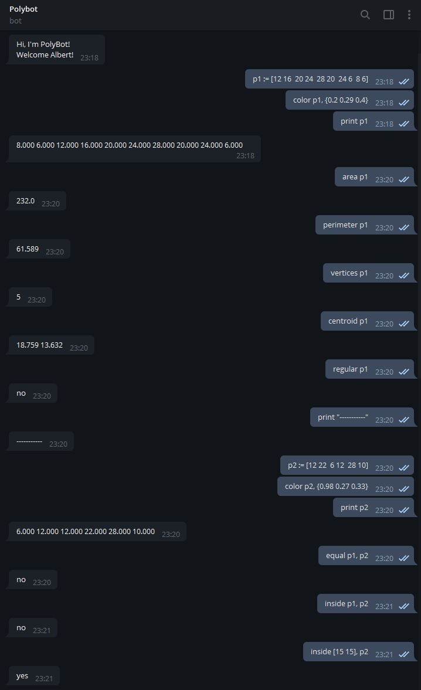
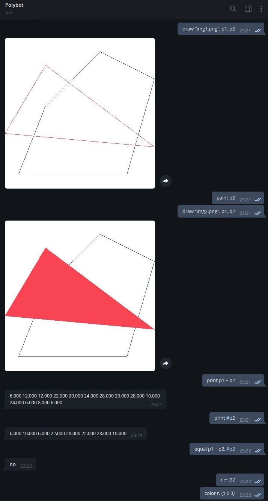

# PolyBot

> Pràctica de Python i Compilació de Llenguatges de programació (edició tardor 2020).

<!-- TABLE OF CONTENTS -->
<details open="open">
  <summary>Table of Contents</summary>
  <ol>
    <li>
      <a href="#about-the-project">About The Project</a>
      <ul>
        <li><a href="#built-with">Built With</a></li>
      </ul>
    </li>
    <li>
      <a href="#getting-started">Getting Started</a>
      <ul>
        <li><a href="#prerequisites">Prerequisites</a></li>
        <li><a href="#installation">Installation</a></li>
      </ul>
    </li>
    <li><a href="#usage">Usage</a></li>
    <li><a href="#bot-interaction">Bot Interaction</a>
      <ul>
        <li><a href="#commands">Commands</a></li>
        <li><a href="#language">Language</a>
            <ul>
                <li><a href="#instructions">Instructions</a></li>
                <li><a href="#operators">Operators</a></li>
            </ul>
      </ul>
    </li>
    <li><a href="#example-chat">Example Chat</a></li>
    <li><a href="#references">References</a></li>
    <li><a href="#author-info">Author Info</a></li>
  </ol>
</details>

## About The Project

Aquest projecte tracte sobre la implementació d'un bot de Telegram que respon textualment i gràficament a operacions relacionades amb polígons convexos.

### Built With

Aquest projecte s'ha realitzat amb:

* [Python](https://www.python.org/)
* [ANTLR4](https://www.antlr.org/)
* [Telegram bot](https://core.telegram.org/bots)
* [Pillow](https://pillow.readthedocs.io/en/stable/)

## Getting Started

Aquestes instruccions us proporcionaran una còpia del projecte en funcionament a la vostra màquina local amb finalitats de desenvolupament i proves. A continuació s'especifiquen les instruccions per interactuar amb el projecte i el bot de Telegram.

### Prerequisites

Abans de tot per al bon funcionament del projecte es requereix:

* Python3
* Altres requeriments:

```sh
pip3 install -r requeriments.txt
```
_En cas de no funcionar, utilitzar `pip` en comptes de `pip3`_

### Installation

Un cop complerts els prerequisits cal obtenir el _token_ per al funcionament del bot.

1. Instalar i configurar [Telegram](https://telegram.org/).
2. Visitar el [@BotFather](https://telegram.me/botfather).
3. Utilitzar la comanda `/newbot` i proporcionar la informació requerida per a l'obtenció del _token_. 

Còpia el _token_ i enganxa'l al arxiu `token.txt` que es troba en la carpeta bot.

A partir d'aquí ja es pot interactuar amb el bot.

**Nota**: Les instruccions completes són a https://core.telegram.org/bots#6-botfather.

## Usage

Per compilar i executar la implementació de la part de compiladors s'ha de fer el següent:

* Dins de la carpeta **cl**, compilar la gramàtica Polygons.g.

```sh
antlr4 -Dlanguage=Python3 -no-listener -visitor Polygons.g
```

Un cop realitzat la compilació podrem testejar la gramàtica amb certs inputs a partir del script `TestScript.py`.

```sh
cat input.txt | python3 TestScript.py
```
 or
```sh
python3 TestScript.py < input.txt
```

**Nota:** _Es proporcionan dos arxius exemples d'entrada, `input.txt` i `example.txt`_

A partir de la implementació de la part de compiladors i la classe `ConvexPolygon`, s'implementa un bot per Telegram capaç de gestionar comandes relacionades amb polígons. 

Per utilitzar el bot s'ha d'executar la següent comanda des de la carpeta **bot**.

```sh
python3 bot.py
```

Un cop executat, el bot estarà actiu. Llavors si es va a l'aplicació Telegram i es busca `@itsPolyBot` et trobaràs el bot amb el qual podràs xatejar. El bot es diu Polybot i podràs interactuar amb ell a partir de certes commandes especificades a la secció [Bot Interaction](#bot-interaction).

## Bot Interaction

A continuació s'espesifiquen totes les interaccions possibles amb el bot.

### Commands

* **/start**: Inicia la conversació amb Polybot.
* **/help**: S'obté una llista amb les comandes que el bot pot interactuar.
* **/author**: Informació sobre el creador del bot.
* **/example**: Exemple de com utilitzar el seu llenguatge.

### Language

Els **polígons** s'identifiquen com: 
`p`, `Q`, `p1`, `p2`, `pol_gr`, ...

Els **punts** de les comandes són donats per dos parells de nombres reals, en notació estàndard, per denotar les coordenades X i Y. Al imprimir tenen el format de tres dígits després del punt decimal.

Els **colors** es donen entre claus per 3 nombres reals a [0,1], en notació RGB.

La comanda d'**assignació** (`:=`) associa una variable a un polígon convex. Els polígons nous són negres per defecte.

#### Instructions

* `area`: Imprimeix el perímetre del polígon donat.
* `centroid`: Imprimeix el centroide del polígon donat.
* `color`: Associa un color a la variable de polígon donada.
* `draw`: Dibuixa una llista de polygons amb cadascun amb el seu color associat.
* `equal`: Imprimeix si o no per saber si els dos polígons són iguals o no.
* `inside`: Donats dos polígons, imprimeix si o no per saber si el primer es troba dins del segon o no.
* `paint`: Donada una variable de polígon, quan s'utilitzi `draw` es dibuixarà el polígon tot pintat amb el seu corresponent color.
* `perimeter`: Imprimeix el perímetre del polígon donat.
* `print`: Imprimeix un poígon o un text determinat.
* `regular`: Imprimex si o no per saber si el polígon donat es regular.
* `unpaint`: Donada una variable de polígons, quan s'utilitzi `draw` es dibuixarà el polígon perfilat amb el seu corresponent color. 
* `vertices`: Imprimeix el nombre de vèrtexs del polígon donat.

#### Operators

* `*`: Representa la intersecció de dos polígons.
* `+`: Representa la unió convexa de dos polígons.
* `#`: Representa la caixa delimitadora d'un polígon.
* `!n`: Retorna un polígon convex format amb punts `n` dibuixats a l'atzar al quadrat de la unitat ([0,1]²).

## Example Chat




## References

- Gràfics simples en Python. Salvador Roura. 2020.
https://lliçons.jutge.org/grafics/
- Bots de Telegram. Jordi Petit. 2020.
https://lliçons.jutge.org/python/telegram.html
- Càlcul de l'envolupant convexa: Jordi Cortadella. 2020.
Transpes 56 a 62 de https://www.cs.upc.edu/~jordicf/Teaching/AP2/pdf/03_AlgorithmAnalysis.pdf

## Author Info

- Nom: Albert Ibars Cubel
- Correu: albert.ibars.cubel@estudiantat.upc.edu